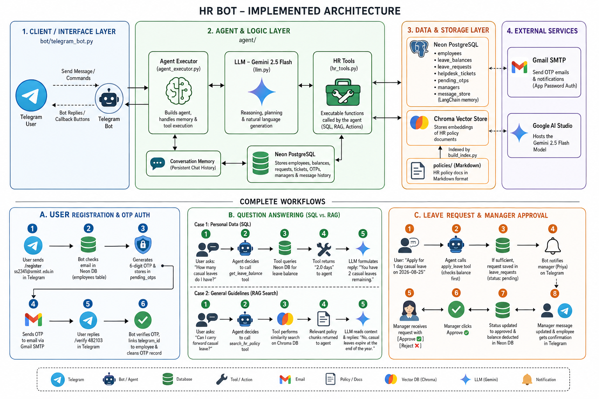

# HR Agent & RAG Bot (Prototype)

An intelligent, context-aware HR conversational assistant that runs on Telegram. It uses LangChain to dynamically route user requests to SQL databases, vector document databases (RAG), or transaction execution pipelines.

## 🏗️ System Architecture & Workflows

Below is the complete architectural layout of the HR Bot:



The application is structured into four main layers:
1. **Client / Interface Layer**: Handles communication with the Telegram API (`bot/telegram_bot.py`).
2. **Agent & Logic Layer**: Orchestrates LLM reasoning, memory persistence, and tool triggering (`agent/` and `tools/`).
3. **Data & Storage Layer**: Stores relational data in SQLite or Neon PostgreSQL, and semantic policy embeddings in a local Chroma Vector Store.
4. **External Services**: Integrates with Google AI Studio (for the Gemini 2.5 Flash model) and Gmail SMTP (for OTP email delivery).

---

## 🚀 Key Features & Complete Workflows

### A. User Registration & Secure OTP Auth
* **Registration**: Employees initiate access by sending `/register <email>` on Telegram.
* **OTP Generation**: The system validates the email against the `employees` table, generates a secure 6-digit OTP, and persists it in `pending_otps`.
* **SMTP Delivery**: The OTP is sent to the employee's corporate email via Gmail SMTP using App Password authentication.
* **Verification**: The user enters `/verify <OTP>` on Telegram. The agent maps the user's `telegram_id` to their `employee_id` and purges the OTP record.

### B. Intelligent Question Answering (SQL vs. RAG)
* **Structured Queries (SQL)**: When a user asks personal questions (e.g., *"How many sick leaves do I have left?"*), the agent invokes `get_leave_balance` to query the employee's balances table directly.
* **Unstructured Policy Queries (RAG)**: For general policy queries (e.g., *"What is the carry-forward policy for unused leaves?"*), the agent runs `search_hr_policy` to retrieve matching context chunks from Chroma DB and formats the response under policy guidelines.

### C. Leave Requests & Multi-Step Approvals
* **Validation**: When an employee requests leave, the agent checks their balance.
* **Staging**: If the balance is sufficient, the agent inserts a record into the database with a status of `pending_manager_approval`.
* **Manager Notification**: The agent proactively alerts the employee's manager on Telegram with interactive `[Approve ✅]` and `[Reject ❌]` buttons.
* **Approval Processing**: Upon approval, the employee's balance is automatically deducted, and they receive a confirmation message.

---

## 📁 Repository Layout

```
hr-bot-prototype/
├── architecture.png        # System architecture and workflow diagram
├── config.py              # Loads .env configurations and initializes LLM
├── requirements.txt       # Project python dependencies
├── db/
│   └── init_db.py         # Schema definition and database seeding script
├── policies/               # Markdown policy files (Source for RAG)
│   ├── leave_policy.md
│   └── wfh_policy.md
├── rag/
│   ├── __init__.py
│   └── build_index.py      # Reads policies, computes embeddings, and builds Chroma Index
├── tools/
│   ├── __init__.py
│   └── hr_tools.py          # LLM-callable tools (Securely bound to session employee_id)
├── agent/
│   ├── __init__.py
│   ├── llm.py                # Swappable LLM client factory (Gemini / OpenRouter)
│   └── agent_executor.py     # Session-based agent executor with memory
└── bot/
    ├── __init__.py
    └── telegram_bot.py       # Telegram frontend utilizing python-telegram-bot
```

---

## 🛠️ Installation & Setup

### 1. Clone & Install Dependencies
Ensure you have Python 3.10+ installed.
```bash
pip install -r requirements.txt
```

### 2. Configure Environment
Copy the example environment file:
```bash
cp .env.example .env
```
Fill out the required configuration values:
* `LLM_PROVIDER`: Set to `gemini` or `openrouter`
* `GOOGLE_API_KEY` or `OPENROUTER_API_KEY`: API keys to access the LLM.
* `TELEGRAM_BOT_TOKEN`: The bot token obtained from [@BotFather](https://t.me/BotFather).
* `DATABASE_URL`: (Optional) Connection string for Neon PostgreSQL. If left blank, local SQLite (`hr.db`) is used.
* **SMTP Settings**: Fill in SMTP details to enable email OTP registration.

### 3. Initialize the Database
Seed the mock HR database with sample employees, managers, and starting balances:
```bash
python -m db.init_db
```

### 4. Build the RAG Policy Index
Processes all documents inside `policies/` and constructs the Chroma Vector Store:
```bash
python -m rag.build_index
```
*(Note: First run downloads the embedding model, which is ~90MB).*

### 5. Start the Telegram Bot
Launch the listener process:
```bash
python -m bot.telegram_bot
```

---

## 🔐 Security Considerations

To transition from a prototype to a production deployment, address the following security shortcuts:
1. **SSO / OTP Integrity**: Move `/register` to standard Single Sign-On (SSO) or verify email domains strictly.
2. **Context Binding**: Database operations are hard-bound to the session-verified `employee_id` inside the backend. **Never** allow the LLM to supply `employee_id` as an input argument to avoid cross-tenant access.
3. **Session Persistence**: Relocate chat histories from local memory to a database storage provider (e.g. Postgres Redis store).
